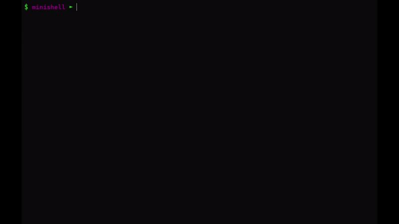

<h1 align="center"> Minishell - Our Own Simple Shell </h1>

  

## Overview
Minishell is a project focused on creating a simple shell, offering a glimpse into the world of processes and file descriptors. As a developer, you'll delve into the fundamentals of shell functionality, including command execution, history management, and handling various special characters.

## Key Features

- **Prompt:** Displays a prompt when waiting for a new command.
- **History:** Includes a working command history feature.
- **Command Execution:** Searches and launches the right executable based on the PATH variable or using a relative or absolute path.
- **Quoting:** Handles single and double quotes, preventing interpretation of meta-characters.
- **Redirections:** Implements input and output redirections, as well as append mode.
- **Pipes:** Supports command pipelines using the '|' character.
- **Environment Variables:** Expands variables such as $PATH.
- **Built-in Commands:** Implements essential built-ins like echo, cd, pwd, export, unset, env, and exit.
- **Signal Handling:** Responds to signals such as ctrl-C, ctrl-D, and ctrl-\ in interactive mode.
- **Bash-like Behavior:** Mimics behavior similar to Bash for various functionalities.

## References

- https://pubs.opengroup.org/onlinepubs/009695399/utilities/xcu_chap02.html
- https://www.cs.purdue.edu/homes/grr/SystemsProgrammingBook/Book/Chapter5-WritingYourOwnShell.pdf
- https://faculty.cs.niu.edu/~hutchins/csci480/signals.htm
- https://www.gnu.org/software/bash/manual/bash.html
- https://www.oilshell.org/blog/2019/02/07.html
- https://www.geeksforgeeks.org/developing-linux-based-shell/
- https://hal.science/hal-01890044/file/main.pdf
- http://savage.net.au/Ron/html/graphviz2.marpa/Lexing.and.Parsing.Overview.html
- https://mukulrathi.com/create-your-own-programming-language/parsing-ocamllex-menhir/
- https://tomassetti.me/guide-parsing-algorithms-terminology/

## Grade

  

